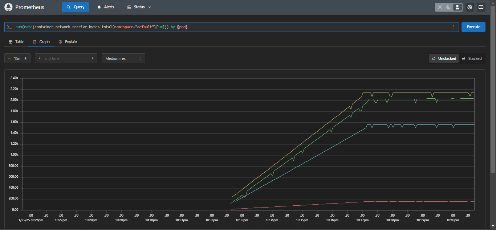

# Multi Tier Voting app-on k8s kind

## Overview

This guide covers the steps to:
- Launch an AWS EC2 instance.
- Install Docker and Kind.
- Create a Kubernetes cluster using Kind.
- Install and access kubectl.
- Install and configure Argo CD.
- Connect and manage your Kubernetes cluster with Argo CD.
- Observability with Prometheus & Grafana.

## Application


* A front-end web app in [Python](/vote) which lets you vote between two options
* A [Redis](https://hub.docker.com/_/redis/) which collects new votes
* A [.NET](/worker/) worker which consumes votes and stores them in…
* A [Postgres](https://hub.docker.com/_/postgres/) database backed by a Docker volume
* A [Node.js](/result) web app which shows the results of the voting in real time

## Architecture


## ArgoCD Configuration


## Observability





# To install a Kind (Kubernetes IN Docker) cluster on an AWS Ubuntu instance, follow these steps:

## Update your system
```bash
sudo apt-get update -y
```

## Install the Docker
```
sudo apt-get install docker.io -y
```

## Add the User in Docker group and Refresh the group
```
sudo usermod -aG docker $USER && newgrp docker
```
## KIND Cluster Setup Guide

## Installing KIND, & kubectl
Install KIND and kubectl using the provided script:
```bash

#!/bin/bash

[ $(uname -m) = x86_64 ] && curl -Lo ./kind https://kind.sigs.k8s.io/dl/v0.20.0/kind-linux-amd64
chmod +x ./kind
sudo cp ./kind /usr/local/bin/kind

VERSION="v1.30.0"
URL="https://dl.k8s.io/release/${VERSION}/bin/linux/amd64/kubectl"
INSTALL_DIR="/usr/local/bin"

curl -LO "$URL"
chmod +x kubectl
sudo mv kubectl $INSTALL_DIR/
kubectl version --client

rm -f kubectl
rm -rf kind

echo "kind & kubectl installation complete."
```
## Run the following script
```
chmod +x install.sh
./install.sh
```

## Setting Up the KIND Cluster
Create a kind-cluster-config.yml file:

```yml

kind: Cluster
apiVersion: kind.x-k8s.io/v1alpha4

nodes:
- role: control-plane
  image: kindest/node:v1.31.2
- role: worker
  image: kindest/node:v1.31.2

```
Create the cluster using the configuration file:

```bash

kind create cluster --config kind-cluster-config.yaml --name my-kind-cluster
```
Verify the cluster:

```bash

kubectl get nodes
kubectl cluster-info
````
## Cloning and Running the Example Voting App

- Clone the voting app repository:
  ```bash
  git clone https://github.com/kaivalya-bachkar/Multi-Tier-Voting-app-on-k8s-kind.git
  ```

- Apply Kubernetes YAML specifications for the voting app:
  ```bash
  kubectl apply -f Kubernetes/
  ```

- List all Kubernetes resources:
  ```bash
  kubectl get all
  ```

- Forward local ports for accessing the voting and result apps:
  ```bash
  kubectl port-forward service/vote 5000:5000 --address=0.0.0.0 &
  kubectl port-forward service/result 5001:5001 --address=0.0.0.0 &
  ```

## Installing Argo CD

- Create a namespace for Argo CD:
  ```bash
  kubectl create namespace argocd
  ```

- Apply the Argo CD manifest:
  ```bash
  kubectl apply -n argocd -f https://raw.githubusercontent.com/argoproj/argo-cd/stable/manifests/install.yaml
  ```

- Check services in Argo CD namespace:
  ```bash
  kubectl get svc -n argocd
  ```

- Forward ports to access Argo CD server:
  ```bash
  kubectl port-forward -n argocd service/argocd-server 8443:443 &
  ```

- Retrieve Argo CD admin password:
  ```bash
  kubectl get secret -n argocd argocd-initial-admin-secret -o jsonpath="{.data.password}" | base64 -d && echo
  ```
  
# Prometheus and Grafana via HELM

## Install Helm Chart
 ```
  curl -fsSL -o get_helm.sh https://raw.githubusercontent.com/helm/helm/main/scripts/get-helm-3
  chmod 700 get_helm.sh
  ./get_helm.sh
 ```
- To Check Helm get installed
 ```
helm version
 ```
- Add Helm Stable Charts for Your Local Client
 ```
  helm repo add stable https://charts.helm.sh/stable
 ```

- Add Prometheus Helm Repository
 ```
  helm repo add prometheus-community https://prometheus-community.github.io/helm-charts
 ```

- To get the latest and Updated Helm-chart
```
helm repo update
```

- Create Prometheus Namespace
 ```
  kubectl create namespace monitoring
  kubectl get ns
 ```

- Install Prometheus using Helm
 ```
 helm install kind-prometheus prometheus-community/kube-prometheus-stack --namespace monitoring --set prometheus.service.nodePort=30000 --set prometheus.service.type=NodePort --set grafana.service.nodePort=31000 --set grafana.service.type=NodePort --set  alertmanager.service.nodePort=32000 --set alertmanager.service.type=NodePort --set prometheus-node-exporter.service.nodePort=32001 --set prometheus-node-exporter.service.type=NodePort
 ```

- Verify Prometheus installation
 ```
  kubectl get pods -n monitoring
 ```

- Check the services file (svc) of the Prometheus
 ```
  kubectl get svc -n monitoring
 ```

- To access the Prometheus and Grafana on browser we need to forward the port will using **Kind Cluster** & **Minikube** because the cluster running in docker
```
 kubectl port-forward svc/kind-prometheus-kube-prome-prometheus -n monitoring 9090:9090 --address=0.0.0.0 &
 kubectl port-forward svc/kind-prometheus-grafana -n monitoring 3000:80 --address=0.0.0.0 &
```
 - Retrieve Grafana Initial Admin Password
 ```
  kubectl get secret prometheus-stack-grafana -n monitoring -o jsonpath="{.data.admin-password}" | base64 -d && echo 
 ```

## Prometheus Queries

```bash
sum (rate (container_cpu_usage_seconds_total{namespace="default"}[1m])) / sum (machine_cpu_cores) * 100
sum (container_memory_usage_bytes{namespace="default"}) by (pod)
sum(rate(container_network_receive_bytes_total{namespace="default"}[5m])) by (pod)
sum(rate(container_network_transmit_bytes_total{namespace="default"}[5m])) by (pod)

```
